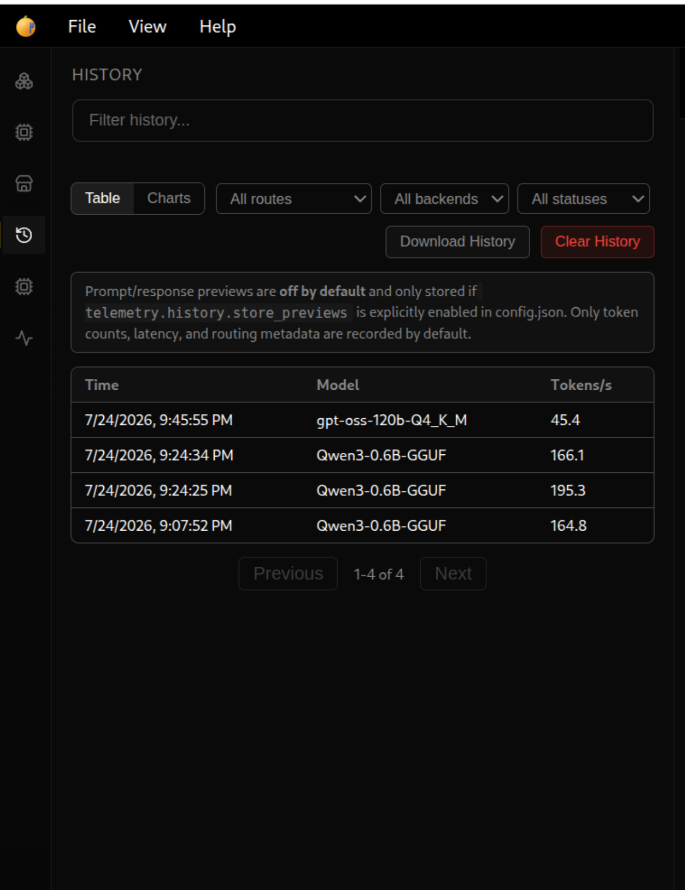
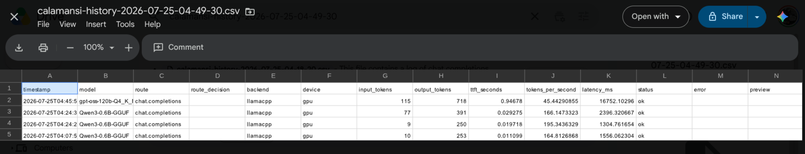

# Telemetry History Viewer

!!! note "Calamansi Juice 2 addition"
    This page documents a fork-only addition on top of upstream Lemonade v11.0.0. See [MERGING.md](https://github.com/rolandpascua-cloud/calamansi-juice-2/blob/main/MERGING.md) for how fork-specific docs like this one are tracked against future `git merge upstream/main` operations.

The Telemetry History Viewer persists a record of past inference requests to a local SQLite database so they remain queryable after a server restart, unlike the live-only [`/spans/stream` WebSocket telemetry feed](../guide/telemetry.md).

## Storage

Records are written to `telemetry_history.db` in the server's cache directory (the same directory as `config.json` and the model cache — see the [Configuration guide](../guide/configuration/README.md)). The store subscribes to the same internal span-completion pub/sub the WebSocket telemetry stream uses, so it captures every request handled by the 5 instrumented inference routes: chat completions, completions, embeddings, reranking, and responses.

A background task prunes rows older than `telemetry.history.max_age_days` (default 30) or beyond `telemetry.history.max_rows` (default 10,000), whichever is stricter, every 10 minutes.

## Privacy

**Full prompt/response text is never stored by default.** Only token counts, latency, tokens/sec, model/route/backend/device, and success/error status are recorded. To opt in to storing a truncated prompt/response preview (for debugging), set in `config.json`:

```json
{
  "telemetry": {
    "history": {
      "store_previews": true,
      "preview_max_chars": 200
    }
  }
}
```

## Config keys

All under `telemetry.history` in `config.json`:

| Key | Default | Description |
|---|---|---|
| `enabled` | `true` | Whether new requests are recorded. Existing rows still age out via pruning even when disabled. |
| `store_previews` | `false` | Opt-in: store a truncated prompt/response preview per record. |
| `preview_max_chars` | `200` | Truncation length for previews, when enabled. |
| `max_rows` | `10000` | Row cap enforced by the pruning task. |
| `max_age_days` | `30` | Age cap enforced by the pruning task. |

## API

### `GET /api/v1/telemetry/history`

Query params (all optional): `since`, `until` (unix ms), `model`, `route`, `backend`, `limit` (default 50, max 500), `offset`.

```json
{
  "records": [
    {
      "id": 1,
      "request_id": "…",
      "timestamp_ms": 1732000000000,
      "model_name": "Qwen2.5-7B-Instruct",
      "route": "chat.completions",
      "route_decision": "default",
      "prompt_tokens": 120,
      "completion_tokens": 45,
      "latency_ms": 850.5,
      "ttft_seconds": 0.18,
      "tokens_per_second": 52.9,
      "backend": "llamacpp",
      "device": "gpu",
      "success": true,
      "error": "",
      "preview": ""
    }
  ],
  "total": 1,
  "limit": 50,
  "offset": 0
}
```

### `GET /api/v1/telemetry/history/summary`

Query params (optional): `since`, `until`. Returns server-computed aggregates for charting, so the GUI never has to pull raw rows:

```json
{
  "avg_tokens_per_second_by_model": [{"model": "…", "avg_tokens_per_second": 52.9, "request_count": 12}],
  "requests_by_day": [{"date": "2026-07-20", "count": 12, "errors": 1, "error_rate": 0.083}],
  "overall": {"total_requests": 12, "total_errors": 1, "error_rate": 0.083}
}
```

### `POST /internal/telemetry/history/clear`

Deletes all stored history. Requires the admin API key when one is configured (same as `/internal/telemetry/flush`).

## Authentication

These endpoints reuse the server's existing API-key auth — no separate credential. `GET`/`GET .../summary` are scoped like the WebSocket spans stream: an admin token sees every record, a regular token sees only its own requests. On an open server (no `LEMONADE_API_KEY` configured — the common local single-user case), there is no access boundary to scope by, so all history is visible, matching how the rest of the REST API already behaves when no key is set.

## GUI

A "History" tab appears in the left-panel rail alongside Models/Backends/Marketplace/Settings. The table stays compact (Time/Model/Tokens-per-second) to fit the panel's fixed width — route, backend, device, input/output tokens, TTFT, latency, and status are available on row hover instead of as columns. A chart view covers tokens/sec by model, requests per day, and error rate per day. "Download History" exports the complete history (every field, not just the current page) as CSV; "Clear History" deletes all stored records.



The downloaded CSV includes every field the table doesn't show inline:


