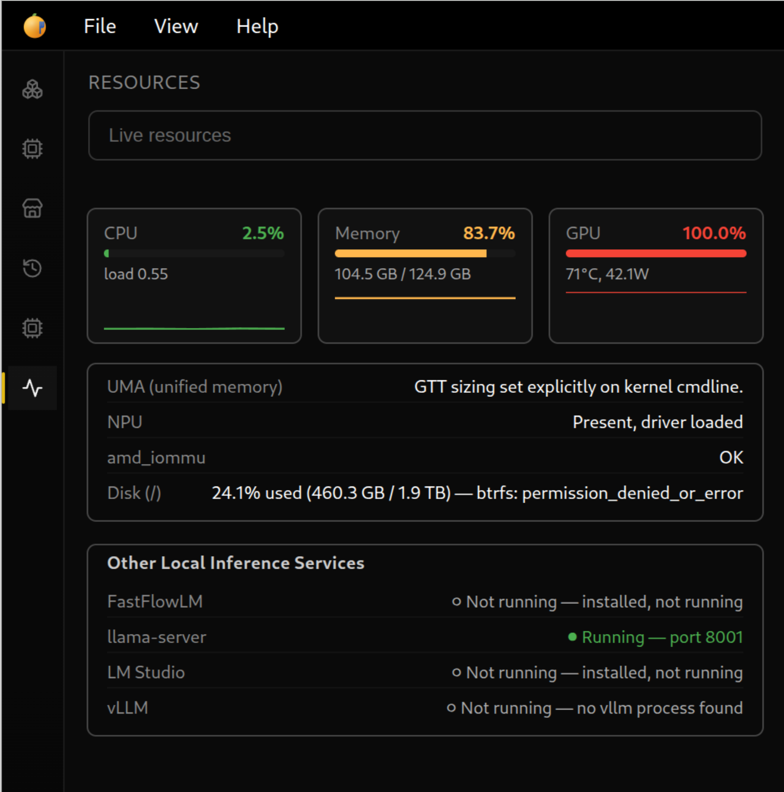

# Resource Dashboard

!!! note "Calamansi Juice 2 addition"
    This page documents a fork-only addition on top of upstream Lemonade v11.0.0. See [MERGING.md](https://github.com/rolandpascua-cloud/calamansi-juice-2/blob/main/MERGING.md) for how fork-specific docs like this one are tracked against future `git merge upstream/main` operations.

The Resource Dashboard is a live-updating resource monitor, architecturally modeled on (not copied from) the [amd-ai-max-dashboard](https://github.com/rolandpascua-cloud/amd-ai-max-dashboard) reference project. It's distinct from the [System State Viewer](system-state.md): that's an on-demand snapshot, this is meant to be polled continuously while the Resources tab is open.

## API

### `GET /api/v1/resources/system`

CPU, memory, GPU, NPU, disk, and sensor readings. Meant to be polled every ~2 seconds — every collector is cheap and every subprocess call uses a 2-second timeout, so a hung CLI can never hang a poll. Each top-level section is independently collected; a failing collector reports `{"error": "..."}` in its own section rather than failing the whole response.

```json
{
  "cpu": {
    "per_core_percent": [13.2, 5.6, "..."],
    "aggregate_percent": 3.9,
    "core_count_logical": 32,
    "core_count_physical": 16,
    "current_mhz": 3270.5,
    "min_mhz": 2000.0,
    "max_mhz": 5187.5,
    "load_average": {"1m": 6.24, "5m": 3.82, "15m": 2.07}
  },
  "memory": {
    "total": 134163750912, "used": 12973342720, "free": 96534728704, "percent": 9.7,
    "uma": {
      "amdgpu_gttsize": null, "amdgpu_gttsize_set_on_cmdline": false,
      "ttm_pages_limit": "24967037", "ttm_pages_limit_set_on_cmdline": true,
      "note": "GTT sizing set explicitly on kernel cmdline."
    }
  },
  "gpu": {
    "source": "rocm-smi", "utilization_percent": 9.0, "vram_used_percent": 94.0,
    "vram_total_bytes": 536870912, "vram_used_bytes": 508157952,
    "temperature_c": 60.0, "power_watts": 19.064
  },
  "npu": {
    "amd_iommu_ok": true, "amd_iommu_note": "amd_iommu=on - OK for NPU binding.",
    "amdxdna_module_loaded": true, "present": true,
    "utilization_available": false,
    "utilization_note": "No standard utilization metric is exposed for the NPU on this stack; reporting presence/binding status only."
  },
  "disk": {"total": 2047334486016, "used": 489964744704, "free": 1557369741312, "percent": 23.9, "btrfs_status": "permission_denied_or_error", "btrfs_error": "..."},
  "sensors": {"k10temp": [{"label": "Tctl", "current": 62.5, "high": null, "critical": null}]},
  "timestamp": 1732000000.5
}
```

Notes:

- **CPU percent is delta-based**: the first poll after server start has no prior `/proc/stat` sample to diff against, so it reports `null` per-core values rather than a meaningless number — the same "prime on first call" behavior the reference dashboard implements with `psutil`. The second poll onward reports real percentages.
- **UMA framing carries over from the System State Viewer**: `memory.uma` names which kernel param (`amdgpu.gttsize` vs `ttm.pages_limit`) is actually sizing the GTT carve-out, since that's the real "how much VRAM" answer on this hardware.
- **GPU** tries `rocm-smi` first, falls back to `amd-smi`, and reports `{"error": "..."}` with both failure reasons if neither is usable — never a 500.
- **NPU utilization is explicitly not available**: most tooling doesn't expose an NPU utilization metric on this stack, so `utilization_available` is always `false` with a note explaining why, rather than a fabricated number.
- **Disk** reports Btrfs subvolume info only if the `btrfs` CLI is installed and permitted; a permission failure is `btrfs_status: "permission_denied_or_error"` (informational), not an endpoint error.

### `GET /api/v1/resources/inference`

Detects **other** local inference services running alongside this app — LM Studio, standalone `llama-server`, vLLM, FastFlowLM. Deliberately excludes this app itself (`lemond`/`calamansid`), since that would be redundant with the app's own state (already exposed via `/health`, loaded models, etc.). Shells out more than `/resources/system` (process enumeration, per-service HTTP probes), so meant to be polled slower — every ~4-5 seconds.

No hardcoded ports: a service's listening port is discovered via `/proc/net/tcp{,6}` + `/proc/[pid]/fd/*` socket-inode cross-referencing (the same technique `psutil` uses internally on Linux), falling back to parsing the process's own `--port`/`-p` argv when socket introspection is denied (e.g. the process is owned by a different system user) — real runtime evidence, never a guess.

```json
{
  "lmstudio": {"cli_found": true, "cli_path": "~/.lmstudio/bin/lms", "app_process_running": false, "loaded_models": [], "running": false},
  "llama_server": {"process_running": false, "note": "llama-server process not found"},
  "vllm": {"process_running": false, "note": "no vllm process found"},
  "fastflowlm": {"cli_found": true, "process_running": true, "pid": 7291, "port": 8002, "port_source": "cmdline (socket introspection denied)", "tier": "NPU", "installed_count": 1, "total_available_count": 37},
  "timestamp": 1732000000.8
}
```

## Authentication

Same bearer-token auth as the rest of the REST API.

## GUI

A "Resources" tab in the left-panel rail: live gauges + sparklines for CPU/memory/GPU, a UMA callout, NPU/amd_iommu/disk status, and a list of other detected local inference services with their status. Polling starts when the tab is opened and stops automatically both when the tab is switched away from (the panel unmounts) and when the browser/app window is backgrounded (`document.hidden`), to avoid needless load.

An "Open Strix Halo Dashboard" button links out to the bundled [Strix Halo Dashboard](#bundled-strix-halo-dashboard) service (`http://localhost:8420`) rather than embedding it — it's a separate FastAPI process, not a panel in this app.



## Bundled Strix Halo Dashboard

On Linux installs, `calamansi-juice-server` also installs and can run [Strix Halo Dashboard](https://github.com/rolandpascua-cloud/amd-ai-max-dashboard) — a standalone FastAPI service (same author, MIT-licensed) that this Resources tab's own architecture was originally modeled on. It's vendored into the build via CMake `FetchContent`, pinned to a specific commit, and installed as its own systemd unit (`strix-halo-dashboard.service`) alongside `calamansi-juice-server.service`.

It is **not enabled by default** — start it with:

```sh
sudo systemctl enable --now strix-halo-dashboard
```

On first start it creates its own Python virtual environment (under `StateDirectory=strix-halo-dashboard`, i.e. `/var/lib/strix-halo-dashboard/venv`) and installs its pinned `fastapi`/`uvicorn`/`psutil` dependencies — this requires network access on first run only. It listens on `127.0.0.1:8420` (loopback-only, deliberately more restrictive than that project's own default of `0.0.0.0`, since it's now reached exclusively via the Resources tab's link rather than being a standalone LAN-facing tool).

This is a genuinely separate application, not a Calamansi Juice 2 feature — see its own repository for API/collector details.
